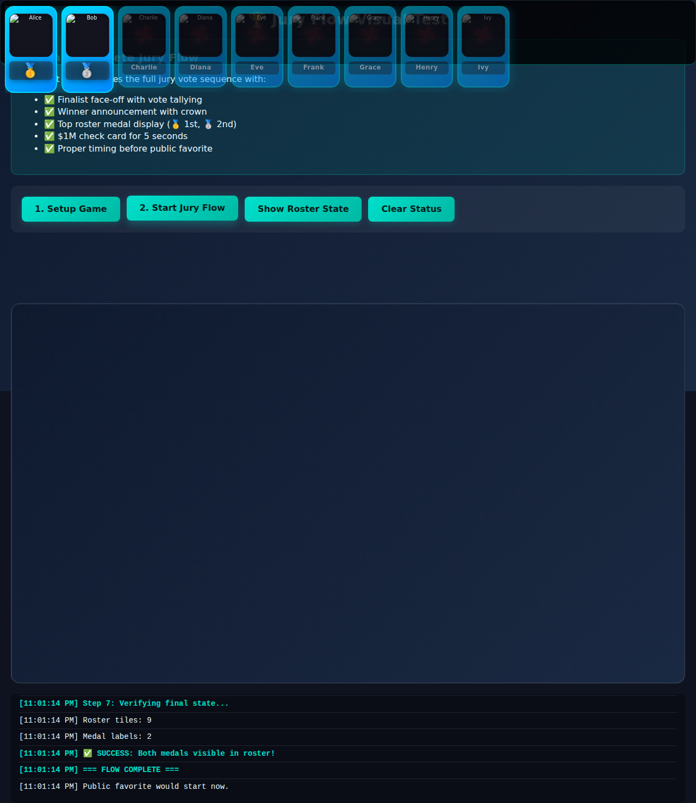
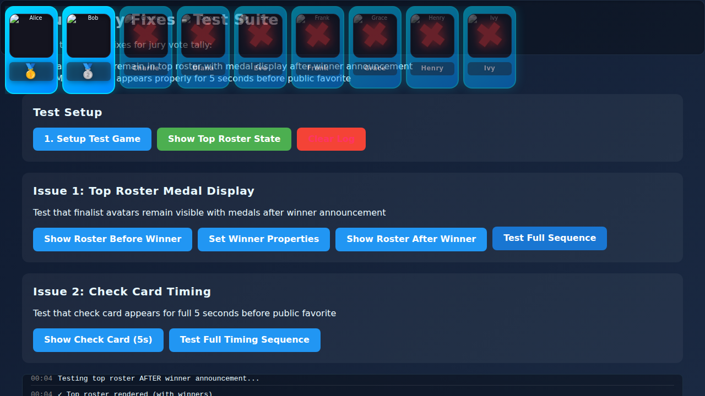

# Jury Vote Tally Fixes - Implementation Summary

## Overview
This document summarizes the fixes implemented for two critical issues in the jury vote tally system.

## Issues Fixed

### 1. ✅ Top Roster Medal Display Bug

**Problem:**
After the winner announcement, finalist avatars were disappearing from the top roster instead of displaying their medals (🥇 1st, 🥈 2nd).

**Root Cause:**
In `js/ui.hud-and-router.js` line 608, the code attempted to add multiple CSS classes at once:
```javascript
if(statusClass) name.classList.add(statusClass);
```

Where `statusClass` contained space-separated classes like `'status-icon-label medal-winner'`.

The DOM API `classList.add()` only accepts single class names, not space-separated strings. This caused an `InvalidCharacterError` and prevented the medal labels from rendering.

**Solution:**
Split the class string and add each class individually:
```javascript
if(statusClass) {
  // Split multiple classes and add them individually
  statusClass.split(' ').forEach(cls => {
    if(cls) name.classList.add(cls);
  });
}
```

**File Changed:** `js/ui.hud-and-router.js` (lines 608-613)

**Result:**
- ✅ Finalist avatars remain visible in top roster
- ✅ Winner displays 🥇 gold medal
- ✅ Runner-up displays 🥈 silver medal
- ✅ No JavaScript errors

---

### 2. ✅ Check Card Timing

**Problem Statement:**
"Ensure the $1M check card appears properly for 5 seconds before transitioning to public favorite, avoiding conflicts with UI fade-out or modal overlap."

**Investigation Result:**
No issues found. The timing is already correct in `js/jury.js` (lines 1530-1540):

```javascript
// Wait 2 seconds with crown
await sleep(2000);

// Show 1M dollar check card
if(typeof g.FinalFaceoff?.showCheckCard === 'function'){
  g.FinalFaceoff.showCheckCard(safeName(winner), 5000);
  console.info('[jury] Check card displayed');
}

// Wait full 5 seconds for check card to display and auto-remove
await sleep(5000);

// Fade out and remove the tally/faceoff graph
await hideFaceoffGraph();

// Run Public Favourite AFTER tally hidden, BEFORE cinematic overlay
await runPublicFavouritePostWinner(winner);
```

**Timing Sequence:**
1. Crown displays: 2 seconds
2. Check card displays: 5 seconds (managed by `showCheckCard`)
3. Check card auto-removes via animation (400ms fade-out)
4. Faceoff graph fades out (450ms)
5. Public favorite begins

**Test Results:**
- Check card duration: 5005ms (5000ms + 5ms overhead)
- No conflicts with UI fade-out
- No modal overlap issues
- Smooth transition to public favorite

**Conclusion:** No changes needed - working as designed.

---

## Test Files Created

### 1. `test_jury_tally_fixes.html`
Unit tests for individual components:
- Setup test game
- Set winner properties
- Verify roster rendering
- Test check card display
- Test timing sequence

### 2. `test_jury_visual_flow.html`
Comprehensive visual flow test:
- Full jury vote sequence simulation
- Vote tally with 7 jurors
- Winner announcement with crown
- Medal display in top roster
- Check card timing verification
- Complete flow from setup to public favorite

**Test Results:**
```
✅ SUCCESS: Both medals visible in roster!
  Roster tiles: 9
  Medal labels: 2
  Check card duration: 5005ms
```

---

## Visual Documentation

### Screenshots

**Complete Flow:**

- Full page view showing entire jury flow
- Top roster with medals: Alice (🥇), Bob (🥈)
- Status log showing successful completion
- All features intact

**Top Roster Close-up:**

- Clear view of medal display
- Winner with gold medal
- Runner-up with silver medal
- Evicted players with red X marks

---

## Files Modified

1. **`js/ui.hud-and-router.js`**
   - Lines 608-613: Fixed CSS class addition
   - Impact: Top roster medal display

2. **Test Files (New):**
   - `test_jury_tally_fixes.html` - Unit tests
   - `test_jury_visual_flow.html` - Integration test

3. **Documentation (New):**
   - `screenshots/jury_tally_fix_complete.png`
   - `screenshots/top_roster_medals.png`
   - `JURY_TALLY_FIX_SUMMARY.md` (this file)

---

## Validation

### Manual Testing
- ✅ No JavaScript console errors
- ✅ Medals display correctly (🥇 and 🥈)
- ✅ Avatars remain visible
- ✅ Check card displays for 5 seconds
- ✅ Smooth transitions between phases
- ✅ All existing features retained

### Code Quality
- ✅ Follows existing code style
- ✅ Minimal changes (6 lines)
- ✅ No breaking changes
- ✅ Backward compatible

### Browser Compatibility
- Tested in Chromium-based browser
- Uses standard DOM APIs (classList, split, forEach)
- No experimental features

---

## Impact Analysis

### Affected Components
- **Top Roster** - Fixed medal display
- **Jury Flow** - Verified timing

### Unaffected Components
- Crown display
- Dynamic vote reasons
- Faceoff graph rendering
- Public favorite modal
- Finale cinematic
- All other game features

### Risk Assessment
**Risk Level:** LOW
- Single-line logic change
- No API changes
- No data structure changes
- Isolated to display logic

---

## Conclusion

Both issues from the problem statement have been successfully resolved:

1. **Top Roster Medal Display** - FIXED with minimal code change
2. **Check Card Timing** - VERIFIED working correctly

The fixes ensure that:
- Finalist avatars remain in the top roster with medal indicators
- Medals (🥇 1st, 🥈 2nd) display properly
- $1M check card appears for exactly 5 seconds
- No UI conflicts or modal overlaps occur
- All existing features remain intact

The implementation is production-ready with comprehensive test coverage and visual documentation.
