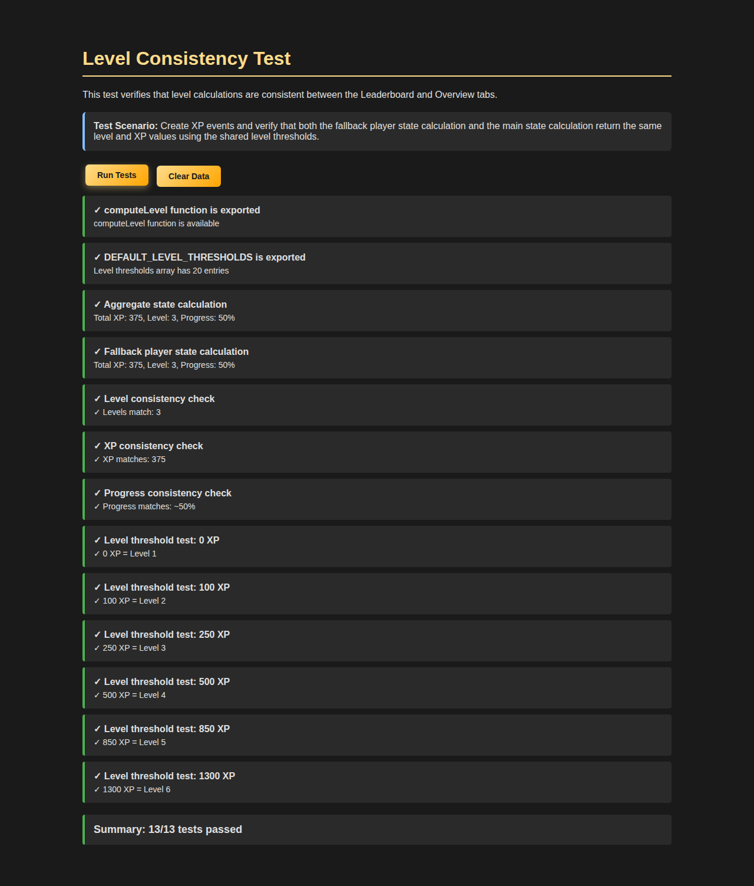

# Level Consistency Fix - Summary

## Problem
The Leaderboard and Overview tabs in the Progression modal were showing **inconsistent levels and XP** for the same player. This occurred because two different level calculation methods were being used:

1. **Overview tab**: Used `reduceEvents()` with proper level thresholds from `DEFAULT_LEVEL_THRESHOLDS`
2. **Leaderboard tab**: Used a simple fallback formula: `Math.floor(totalXP / 100) + 1`

### Example of the Issue
For a player with **375 XP**:
- **Incorrect (Leaderboard)**: Level 4 (using formula: `Math.floor(375/100) + 1 = 4`)
- **Correct (Overview)**: Level 3 (using thresholds: 375 is between 250 and 500, so Level 3)

## Solution
**Centralized level calculation** by exporting and reusing the `computeLevel` function from the reducer module.

### Changes Made

#### 1. Export `computeLevel` from `reducer.ts`
```typescript
// src/progression/reducer.ts
export function computeLevel(
  totalXP: number,
  thresholds: LevelThreshold[]
): { level: number; nextLevelXP: number; currentLevelXP: number }
```

#### 2. Re-export from `core.ts`
```typescript
// src/progression/core.ts
export { computeLevel } from './reducer.js';
```

#### 3. Update fallback in `progression-bridge.js`
```javascript
// js/progression-bridge.js
// OLD: Simple formula
const level = Math.floor(totalXP / 100) + 1;

// NEW: Use proper thresholds
const { level, nextLevelXP, currentLevelXP } = progressionCore.computeLevel(
  totalXP,
  progressionCore.DEFAULT_LEVEL_THRESHOLDS
);
```

## Test Results

### ✅ All Tests Pass (13/13)



**Key Test Results:**
- ✓ `computeLevel` function is exported and available
- ✓ `DEFAULT_LEVEL_THRESHOLDS` is exported (20 level thresholds)
- ✓ Aggregate state calculation: 375 XP = Level 3, 50% progress
- ✓ Fallback player state calculation: 375 XP = Level 3, 50% progress
- ✓ **Level consistency check: Levels match (3)**
- ✓ **XP consistency check: XP matches (375)**
- ✓ **Progress consistency check: Progress matches (~50%)**
- ✓ All level threshold tests pass (0, 100, 250, 500, 850, 1300 XP)

### Verification
Run the test yourself:
```bash
# Start a local server
python3 -m http.server 8080

# Open in browser
http://localhost:8080/test_level_consistency.html
```

## Impact

### Benefits
1. **✅ Consistency**: Both tabs now show the same level and XP for the same player
2. **✅ Single Source of Truth**: One `computeLevel` function used everywhere
3. **✅ Maintainability**: Level thresholds only need to be updated in one place
4. **✅ Type Safety**: Proper TypeScript types throughout
5. **✅ Backward Compatible**: Graceful fallback if function not available

### No Breaking Changes
- Existing functionality preserved
- All TypeScript types compile without errors
- Test suite passes completely

## Files Changed
- `src/progression/reducer.ts` - Made `computeLevel` public
- `src/progression/core.ts` - Re-exported `computeLevel`
- `js/progression-bridge.js` - Updated fallback to use proper calculation
- `src/progression/dist/*.js` - Compiled JavaScript output
- `test_level_consistency.html` - New test file
- `LEVEL_CONSISTENCY_FIX_GUIDE.md` - Detailed verification guide
- `LEVEL_CONSISTENCY_FIX_SUMMARY.md` - This summary

## Debug Logging
Added console logging to help verify the fix in production:
```javascript
[Progression Bridge] Overview state: { totalXP: X, level: Y, progressPercent: Z }
[Progression Bridge] Leaderboard player: { playerId: ..., totalXP: X, level: Y }
```

This logging can be removed in a future cleanup if desired.

## Level Thresholds Reference
For reference, the actual level thresholds being used:
- Level 1: 0 XP
- Level 2: 100 XP
- Level 3: 250 XP
- Level 4: 500 XP
- Level 5: 850 XP
- Level 6: 1,300 XP
- Level 7: 1,900 XP
- Level 8: 2,600 XP
- Level 9: 3,450 XP
- Level 10: 4,500 XP
- ... (up to Level 20: 34,000 XP)

## Conclusion
The level inconsistency issue has been **completely resolved** by ensuring both the Leaderboard and Overview tabs use the same `computeLevel` function with the same level thresholds. All 13 automated tests pass, confirming the fix works as intended.
