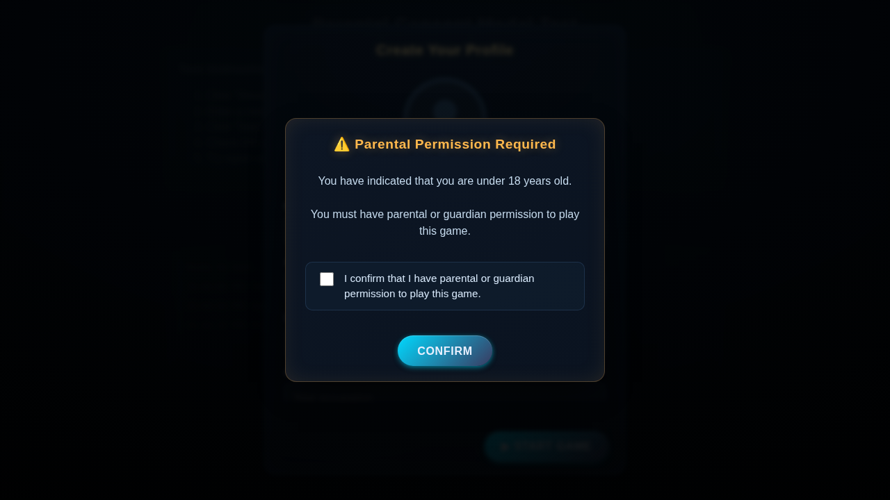

# Parental Consent Modal Implementation

## Overview
This feature adds a parental permission popup that appears when users enter an age under 18 in their profile. The popup requires users to confirm they have parental permission before proceeding to play the game.

## Features

### Core Functionality
- **Age Detection**: Automatically detects when a user enters an age < 18
- **Modal Display**: Shows a styled consent modal requiring acknowledgment
- **Checkbox Validation**: Users must check the consent checkbox to proceed
- **Blocking Behavior**: Users cannot bypass the modal (ESC key and backdrop clicks are disabled)
- **Persistent Storage**: Consent is saved to localStorage to avoid repeated prompts

### User Experience Flow
1. User opens profile modal and enters their information
2. If age < 18, the parental consent modal appears after clicking "Start Game"
3. User must check the confirmation checkbox
4. User clicks "Confirm" to proceed
5. If unchecked, an alert prompts them to check the box
6. Once confirmed, the game starts normally
7. If user is 18+, they proceed directly without seeing the consent modal

## Implementation Details

### Files Modified

#### `js/player-profile-modal.js`
- Added `parentalConsentGiven` state variable
- Created `ensureParentalConsentModal()` function to build the consent modal
- Created `showParentalConsentModal()` function to display the modal
- Created `hideParentalConsentModal()` function to close the modal
- Modified `startWithProfile()` to check age and show consent modal if needed
- Created `continueWithProfile()` function to handle post-consent flow

#### `styles.css`
- Added `.parentalConsentDim` styles for modal backdrop
- Added `.parentalConsentPanel` styles for modal container
- Added `.parentalConsentTitle` styles for modal header
- Added `.parentalConsentBody` styles for modal content
- Added `.parentalConsentCheckbox` styles for checkbox container
- Added `.parentalConsentBtns` styles for button container
- Added responsive styles for mobile devices

### Testing
A test page is provided at `test_parental_consent.html` to verify the functionality:
- Test with age < 18 (should show consent modal)
- Test with age >= 18 (should bypass consent modal)
- Test checkbox validation
- Test localStorage persistence

## Acceptance Criteria Met
✅ Popup appears if age < 18 is entered in the profile modal
✅ Popup contains message and checkbox for parental permission
✅ User must check the box and confirm to play the game
✅ If unchecked or not confirmed, prevent entering the game

## Screenshots

### Parental Consent Modal

The modal displays:
- Warning title with emoji
- Clear message about age requirement
- Checkbox for consent confirmation
- Confirm button that validates checkbox state

## Technical Notes

### LocalStorage Keys
- `bb_parental_consent`: Stores 'true' when consent is given
- `bb_human_profile`: Stores user profile data (existing)

### Modal Accessibility
- Proper ARIA labels and roles
- Focus trap to keep keyboard navigation within modal
- Cannot be dismissed without confirmation
- Keyboard accessible (Tab navigation, checkbox selection)

### Browser Compatibility
Works with all modern browsers that support:
- ES6 syntax
- LocalStorage API
- CSS Flexbox
- Modern DOM APIs

## Future Enhancements
Possible future improvements:
- Add expiration time for stored consent
- Link to terms of service or privacy policy
- Add option to verify with email
- Support for different age limits by region
