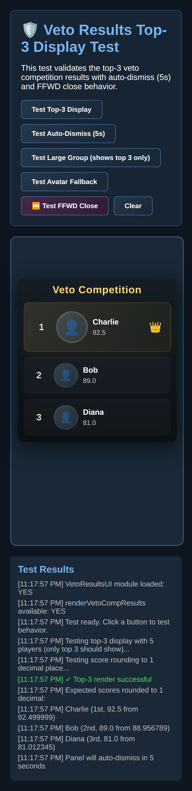
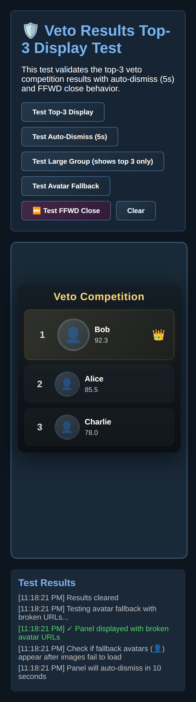

# Veto Ceremony Modernization - Quick Reference

## What Changed?

The veto ceremony has been modernized to match the HOH nomination ceremony style with card-driven flow, avatar integration, and clear decision UX.

## Quick Links

- **Implementation Details:** [VETO_CEREMONY_MODERNIZATION_SUMMARY.md](VETO_CEREMONY_MODERNIZATION_SUMMARY.md)
- **Visual Comparison:** [VETO_CEREMONY_VISUAL_COMPARISON.md](VETO_CEREMONY_VISUAL_COMPARISON.md)
- **Test File:** [test_veto_ceremony_modernized.html](test_veto_ceremony_modernized.html)

## Key Changes Summary

### 1. Ceremony Intro (2400ms)
**Before:** Generic "The holder will make a decision…"  
**After:** POV holder avatar + "As [POV] holds the Power of Veto, please stand and make your decision."

### 2. Decision Panel
**Before:** Multiple buttons (Do NOT use + Use on [Nominee 1] + Use on [Nominee 2])  
**After:** Clear Yes/No buttons → Follow-up "Save Which Nominee?" if multiple nominees

### 3. Card Reveals
**Before:** Text-only cards  
**After:** All cards show avatars with actor → target arrows where applicable

### 4. Code Architecture
**Before:** Callback hell with nested .then() chains  
**After:** Clean async/await pattern

### 5. Preservation
✅ Final 4 bypass logic intact  
✅ All edge-case guards preserved  
✅ Progression hooks maintained  
✅ Social Maneuvers events preserved

## Files Modified

- `js/veto.js` - ~350 lines changed
  - `startVetoCeremony()` → async, buildCardWithAvatars intro
  - `renderVetoCeremonyPanel()` → Yes/No buttons
  - `showNomineeSelection()` → new function for multi-nominee selection
  - `finalizeCeremony()` → async, card-driven reveals
  - `applyReplacementAndContinue()` → async, avatar cards

## Testing

### Automated
```bash
npm run test:all
```
✅ All tests pass

### Manual
1. Open `test_veto_ceremony_modernized.html` in browser
2. Review 10 validation checks (all pass)
3. Inspect card flow previews
4. Test in live game with various scenarios

## Card Flow Preview

### Veto Used Flow
```
1. Ceremony Intro (POV avatar) → 2400ms
2. Yes/No Decision Panel → User input
3. Save Which Nominee? (if multiple) → User input
4. Veto Decision (POV avatar) → 3200ms
5. Saved (POV → Saved, arrow) → 3200ms
6. Replacement Required (HOH avatar) → 3200ms
7. Replacement Selection → User/AI input
8. HOH Announcement (HOH → Replacement, arrow) → 3400ms
9. Replacement (Replacement avatar) → 3600ms
10. Proceed to Social/Live Vote
```

### Veto Not Used Flow
```
1. Ceremony Intro (POV avatar) → 2400ms
2. Yes/No Decision Panel → No
3. Veto Not Used (POV avatar) → 3600ms
4. Proceed to Social/Live Vote
```

### Final 4 Flow
```
NO CEREMONY - Skip directly to Final 4 eviction (unchanged)
```

## Implementation Status

- ✅ Code implementation complete
- ✅ All tests passing
- ✅ Documentation complete
- ✅ Visual comparison created
- ✅ Test file created
- ⏳ Manual QA pending
- ⏳ Live game testing pending

## Veto Competition Results Display

### Vertical Top-3 Results with Rounded Scores, Avatars, and Mobile Fit Strategy

The veto competition displays a vertical top-3 leaderboard with avatar resolution from the avatars folder (matching HOH logic), rounded scores, and intelligent mobile fit strategies. The panel auto-dismisses after 5 seconds and can be closed immediately using fast-forward (FFWD).

**Module:** `js/ui.veto-results.js`

**Usage:**
```javascript
// Call with scores object/Map, participant IDs, and options
window.VetoResultsUI.renderVetoCompResults(scoresObj, participantIds, {
  maxResults: 3,        // Show top 3 only
  autoDismissMs: 5000   // Auto-dismiss after 5 seconds
});
```

**Features:**
- **Vertical Layout**: Always displays results vertically (never horizontal), optimized for readability
- **Top-3 Only**: Displays only the top 3 finishers, sorted by score (descending)
- **Rounded Scores**: All scores rounded to one decimal place (e.g., 9.4, 12.8)
- **Avatar Resolution**: Uses same approach as HOH comp results via `buildSmallAvatar(id)` helper, resolving from `./avatars/` folder with proper fallbacks
- **First Place Emphasis**: Winner gets:
  - Larger avatar (64px vs 48px)
  - Gold gradient background
  - Gold border accent
  - Crown badge 👑
- **Auto-Dismiss**: Panel automatically closes after 5 seconds
- **FFWD Close**: Pressing any fast-forward button immediately closes the panel (no X button)
  - Listens for FFWD button clicks: `.btn-ffwd`, `.ffwd`, `.ffwd-btn`, `#ffwd`, `.player-ffwd`, `.tv-ffwd`, `button.ffwd`
  - Listens for custom events: `fastForwardPressed` and `ffwdPressed`
- **Mobile Fit Strategy**:
  - **Standard mode** (>640px or >700px height): Normal vertical layout with all 3 results
  - **Compact mode** (<640px): Reduced avatar sizes, padding, and spacing
  - **Extra compact mode** (<480px width and <700px height): Further size reductions
  - **Split-card mode** (<480px width and <700px height, if still too tight):
    - Shows winner-only card first (2.5s)
    - Then shows runners-up card (2nd and 3rd place, 2.5s)
    - Total display time still ~5s with smooth transitions
- **Smooth Animations**: Fade-in on show, fade-out on hide/dismiss
- **Accessibility**: ARIA labels, role attributes, semantic HTML

**Styling:** `css/veto-results.css`

**Visual Design:**
- Compact panel: 420px width on desktop, calc(100% - 32px) on mobile
- Dark gradient background with rounded corners
- Gold accent for first place
- Always vertical layout (never horizontal)
- Responsive sizing at 640px and 480px breakpoints
- Height-aware compact mode for short viewports

**Fallback:** If `VetoResultsUI` is not loaded, the system falls back to the legacy tri-slot reveal.

**Screenshot:**


*Vertical top-3 leaderboard with first place emphasized, auto-dismisses after 5s, FFWD closes immediately*


*Split-card mode on very small viewports: winner first, then runners-up*

## Next Steps

1. **Manual QA Testing**
   - Test human POV usage
   - Test AI POV decision-making
   - Test multiple nominees flow
   - Verify Final 4 bypass

2. **Live Game Validation**
   - Confirm card timings feel right
   - Verify avatar displays correctly
   - Check Social Maneuvers events fire
   - Validate Progression XP awards

3. **Edge Case Testing**
   - Test with 2, 3, 4 nominees
   - Test POV holder is also nominee
   - Test all AI affinity thresholds
   - Verify replacement selection edge cases

## Common Scenarios

| Scenario | Flow |
|----------|------|
| Human POV, 2 nominees, uses veto | Intro → Yes → Select nominee → Decision → Saved → Replacement flow |
| Human POV, 2 nominees, doesn't use | Intro → No → Veto not used → Social |
| AI POV, high affinity nominee | Intro → Auto-yes → Decision → Saved → Replacement flow |
| AI POV, low affinity all | Intro → Auto-no → Veto not used → Social |
| Final 4 | Skip ceremony → Direct eviction |
| POV holder is nominee | Auto-use on self |

## Troubleshooting

### Card not showing avatars
- Check if `buildCardWithAvatars` is available
- Falls back to legacy `showCard()` if not available

### Decision panel not appearing
- Check phase is set to 'veto_ceremony'
- Verify `renderVetoCeremonyPanel()` is called

### Final 4 not bypassing ceremony
- Check `handlePostVetoReveal()` logic
- Verify player count is exactly 4

### AI not auto-deciding
- Check AI timer is set (1200ms)
- Verify `aiVetoDecision()` is being called

## Code Example

```javascript
// Ceremony intro with POV avatar
if(global.buildCardWithAvatars){
  await new Promise(function(resolve){
    var card = global.buildCardWithAvatars({
      title: 'Veto Ceremony',
      lines: ['This is the Veto ceremony. As ' + holderName + ' holds the Power of Veto...'],
      tone: 'veto',
      duration: 2400,
      actorId: g.vetoHolder,
      targetIds: [],
      type: 'vetoCeremonyIntro'
    });
    setTimeout(function(){ /* cleanup */ resolve(); }, 2400);
  });
}

// Yes/No decision panel
var btnYes = document.createElement('button'); 
btnYes.className='btn primary'; 
btnYes.textContent='Yes — Use the Veto';
btnYes.onclick = function(){ 
  if(g.nominees.length > 1){
    showNomineeSelection();
  } else {
    finalizeCeremony({ used: true, savedId: g.nominees[0] }); 
  }
};

// Saved card with arrow
await new Promise(function(resolve){
  var card = global.buildCardWithAvatars({
    title: 'Saved',
    lines: [savedName + ' is saved from the block.'],
    tone: 'veto',
    duration: 3200,
    actorId: g.vetoHolder,
    targetIds: [savedId],
    type: 'vetoSaved'
  });
  setTimeout(function(){ /* cleanup */ resolve(); }, 3200);
});
```

## Contact

For questions or issues, refer to:
- Implementation docs: `VETO_CEREMONY_MODERNIZATION_SUMMARY.md`
- Visual guide: `VETO_CEREMONY_VISUAL_COMPARISON.md`
- Test file: `test_veto_ceremony_modernized.html`
